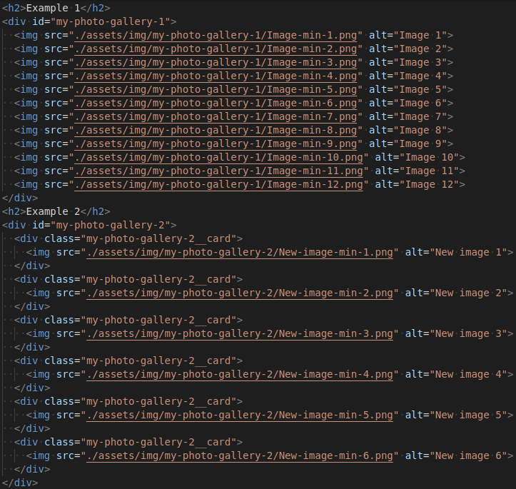
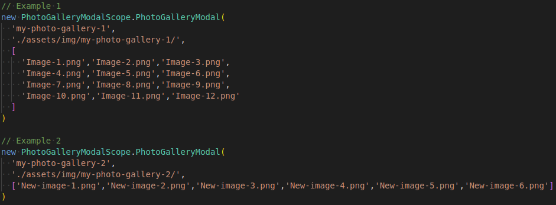
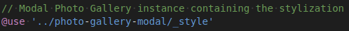
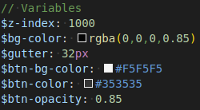
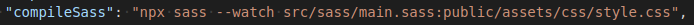
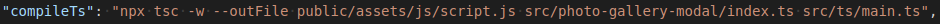
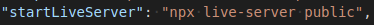

# Photo Gallery Modal Examples
## Repositório base
O repositório [Photo Gallery Modal](https://github.com/vini-cabral/photo-gallery-modal), foi baixado e colado na pasta src (`src/photo-gallery-modal`).  
Veja o projeto publicado [https://photo-gallery-modal-examples.netlify.app/](https://photo-gallery-modal-examples.netlify.app/)
## Estrutura de pastas e arquivos
### HTML
Em `public/index.html`, temos duas Galerias de Imagens:  
  

### TypeScript
Em `src/ts/main.ts`, temos duas instâncias para os dois exemplos de Galeria de Imagem, veja:  
  
Perceba que a instância recebe três parâmetros:  
1. `id` (id do container da Galeria);
2. `pathName` (caminho da pasta com as imagens);
3. `fileNameList` (array com a lista de nomes dos arquivos de imagem).

Existem mais dois parâmetros padrões:  
- `hideBtntime` (tempo em milissegundos para ocultar os botões - __valor padrão 1500ms__);
- `element` (nome da tag em que será criado dinamicamente o Photo Gallery Modal - __elemento padrão body__).

### Sass
Em `src/sass/main.sass`, logo no início do arquivo temos a seguinte importação `src/photo-gallery-modal/_style.sass`  
  

Caso haja necessidade você pode customizar o arquivo de estilo (`src/photo-gallery-modal/_style.sass`) por meio das variáveis:  
  
__NOTA:__ Se você estiver utilizando um valor maior que 1000 no z-index em seu projeto, se necessário, atribua um valor maior em `$z-index`.

## Execução
__NOTA:__
- Todos os comandos devem ser executados na raiz do projeto
- Antes de executar o projeto, use: `npm i`

### Sass (Compilação)
Para compilar o arquivo main.sass, execute: `npm run compileSass`  
Veja os detalhes do comando `npm run compileSass` na imagem abaixo (package.json):  
  
__NOTA:__
- Será gerado o arquivo de estilo `public/assets/css/style.css`;
- Em seu projeto verifique se a compilação está ocorrendo no arquivo que você definiu, e verifique também se ele está corretamente referenciado no arquivo html;
- Como já mencionado, é importante também checar os valores para o z-index.

### TypeScript (Compilação)
Para compilar o arquivo main.ts, execute: `npm run compileTs`  
Veja os detalhes do comando `npm run compileTs` na imagem abaixo (package.json):  
  
__NOTA:__
- Será gerado o arquivo de script `public/assets/js/script.js`;
- `--outFile public/assets/js/script.js` informa o arquivo de saída;
- `src/photo-gallery-modal/index.ts src/ts/main.ts` indica quais arquivos (seguindo a ordem de declaração no comando) serão concatenados no arquivo de saída.
- É esperado que os modais criados dinamicamente sejam os últimos filhos do elemento body.

### Servidor de Desenvolvimento
Execute: `npm run startLiveServer`  
Veja os detalhes do comando `npm run startLiveServer` na imagem abaixo (package.json):  
  